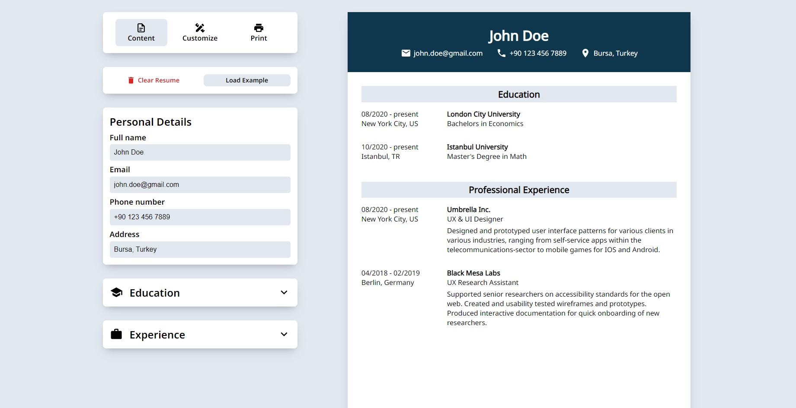
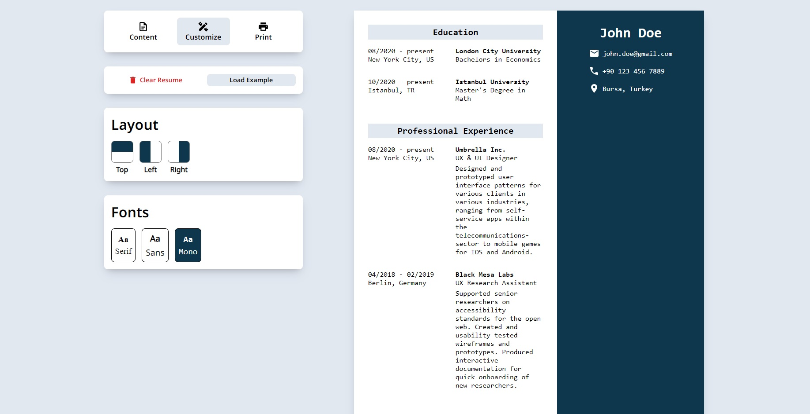

# CV Builder (Deployed to `Vercel`)
## Deployment Address: [`cv-app-react.vercel.app`](https://cv-app-react-wheat.vercel.app "cv-app-react.vercel.app")
### A modern and responsive CV application built with React. This app allows users to create, edit, and download a professional resume easily. The app provides an intuitive interface to input personal details, work experience and education information.

## Table of Contents
- [Features](#features)
- [Demo](#demo)
- [Installation](#installation)
- [Usage](#usage)
- [Technologies Used](#technologies-used)
- [Contributing](#contributing)
- [License](#license)
- [Contact](#contact)

## Features
- User-friendly form to input resume details
- Live preview of the CV
- Ability to download the resume as a PDF
- Custom styling and layout options
- Responsive design

## Demo
**Check out the live demo [here](https://cv-app-react-wheat.vercel.app).**




## Installation
1. Clone the repository
    ```bash
    git clone https://github.com/myinan/cv-app-react.git
    ```

2. Navigate to the project directory
    ```bash
    cd cv-app-react
    ```

3. Install dependencies
    ```bash
    npm install
    ```

4. Start the development server
    ```bash
    npm start
    ```

5. Open your browser and go to `http://localhost:3000`

## Usage
- **Content Section:** Enter your personal details, work experience and education.
- **Customize Section:** Customize the layout and font of your CV.
- **CV Preview:** Preview your CV as it dynamically updates with your input.
- **Print Section:** Print your completed CV or download it as a PDF file.

## Technologies Used
- React
- ESLint, Prettier
- Vercel

## Contributing
Contributions are welcome! Please feel free to submit a Pull Request.

## License
This project is licensed under the MIT License.

## Contact
Created by [Yasir İnan](https://github.com/myinan) - feel free to contact me!
